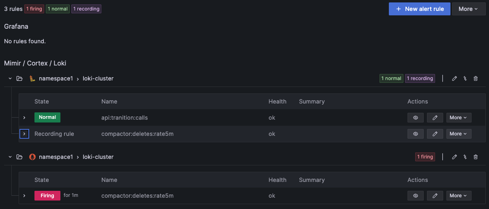
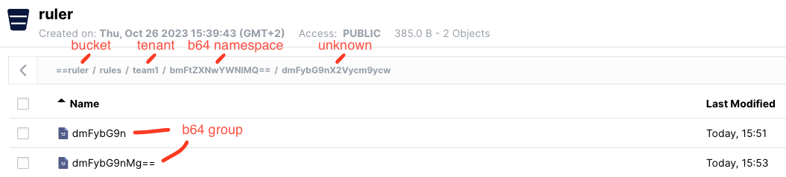

# Demo: Alerting with Loki and Mimir

This project offers a Docker environment for comprehensive alerting testing using Grafana, Loki and Mimir. The setup includes Minio as an S3 rules backend and pre-configured alerting and recording rules in Loki and Mimir.

A k6 script runs for 20 minutes to generate random logs.

## Getting started

Start containers

```
docker compose up -d
```

and apply rules (VS Code Extension "REST Client") using `POST` requests from [loki-ruler.http](loki-ruler.http) and [mimir-ruler.http](mimir-ruler.http).

## UI Endpoints

- [Grafana](http://localhost:3000/)
- [Alertmanager](http://localhost:9093/)
- [Minio](http://localhost:9009/) (user and pass: minioadmin)

## Grafana - Alert rules



## S3 storage of Loki rules

